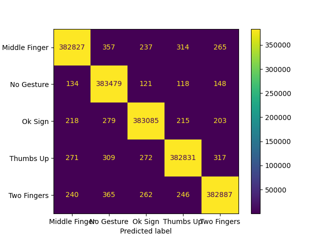
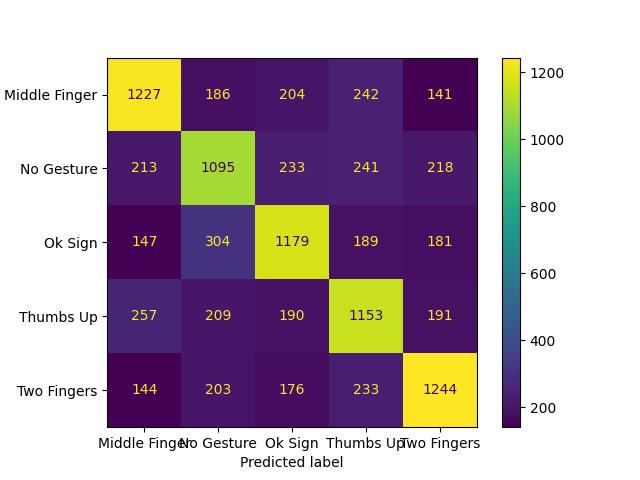

# GestureCV (Work In Progress)
Deep Learning + Computer Vision project to classify one of 4 hand gestures in images/video.

Uses a CNN for Image Classification.

(This was originally an object detection project, but due to time and development constraints I changed it to a purely classification based project).

# Lessons Learned From This

Just as a preliminary to this, here are some very important lessons I learned from this project:

- do not gather your own data unless the data you need doesn't already exist and you have expertise in data collection practices

- training a neural network from scratch is not a good idea; look for pretrained options first.

- try to find simple architectures first, then work your way up if your model is underfitting when being trained

- do not use unbalanced datasets!

- do not expect to be able to train state of the art models on a laptop with a GTX 1650 GPU...lack of compute is certainly a hindrance.

# Data Collection

A total of 1500 image samples were collected, according to the following format:

- 300 photos taken over 5 locations.
- In each location, 50 samples were allocated for each gesture, with 100 being control samples (no gesture).
- For the control samples, 25 had a face, 25 had a hand, 25 had neither, and 25 had both.
- For the gestures, 25 were recorded for each hand in various positions, with approximately half (12-13) of the 25 including faces, with the other half not including any face.
- the gestures recorded are: the middle finger, the ok sign, the thumbs up, and the peace sign (two fingers up)

A few sample images are shown below:

Photos were taken using an iPhone 13 Pro in the HEIC format, with 2316x3088 pixel resolution. When ported to a Windows PC, their resolution changed, with some images being 756x1008 and some being 579x772.

Through a flip along the x axis for the 4 gesture classes, the dataset was expanded to 2500 images, 500 for each class.

# Issues around the data collection

The largest issue is that a single person (myself) was used to take the photos; the model has learned to recognize gestures from people with my hand size, structure, and skin color. For example, if someone with darker skin and a larger hand than mine performed gestures, the model may struggle to recognize their gestures. I predict a more complex architecture than the one ultimately chosen would need to be used to effectivly capture these differences.

Another issue is the size of the dataset; there are only 1500 samples collected, and even after preprocessing (described in the next section), 12000 samples are available. This is far less than datasets used to train state-of-the-art models (such as ImageNet), which contain millions of samples.

Finally, the size of the images; the photos are far larger than popular image dataset sizes (MNIST, for instance, uses 28x28 photos [1]).

# Preprocessing

Preprocessing the data involves a few steps: we first convert the HEIC images to PNG. To ensure all images are the same size, we resize them to a size of 126x126. Then, to increase the size of our dataset, we will create more training examples by taking transformations of the images. 

In this case, we take 90, 180 and 270 degree rotations, then apply Gaussian noise to the images. This results in 8 images generated from 1 original sample, for a total of 12000 images generated from the original data.

We then split the data into 3 groups; 60% being the training data, 20% being the validation data, and 20% being the test data. In each subset, 1/3 of the data contains no gesture, while 1/6 of the subset is allocated for each gesture.

Sample transformed images:

# Choosing An Architecture For The Classifier

To start, the ResNet18 model architecture is chosen; ResNet performs well in image classification [2], and is readily available
through torchvision (disclaimer: torchvision's ResNet implementations do not match the original paper's; torchvision's has significantly more parameters).

If needed, we have access to the ResNet34 and ResNet50 architectures, among others, through torchvision.

# Choosing an optimizer and loss function

The loss function we will use is softmax cross entropy loss; this is a common loss used for image classification [3].

The optimizer we will use is stochastic gradient descent, as this was used by the original ResNet with great success [2].

# Hyperparameter Tuning For The Classifier

For more details regarding this, see the Trials.md file.

Ultimately, I think the data issues are intractable for this problem. The model overfit for many reasons, some of which I list below:

- the dataset is far too small; 1500 images, even with augmentation to several dozen thousand, it is not enough for a classification task for 5 classes, especially since 4 of the classes are relatively similar (the gestures) compared to one of them (the no gesture class). 

- the variance in the images is high. This can lead to overfitting, as high variance in the images makes it difficult for the model to learn underlying structure.

- model architecture is too complex; a complex model architecture can lead to the model "memorizing the data", as the abundance of parameters will lead to more fine tuning, and thus, more variance in the model predictions caused by the extra parameters picking up noise.

- the image resolution is too low (64 x 64 is pretty small for images considering the usual size is 224 x 224).

Future improvements:

- use an already collected dataset of tens of thousands, hundreds of thousands, or even millions of images. This not only allows for more data, but the data collection techniques are probably more professional than something a hobbyist can come up with.

- find a smaller model; perhaps make a custom one for this task?

For the final evaluation of the model, I will train over 20 random seeds, averaging the results to gain a sense of how the model performs without being biased towards a particularly good or bad seed.

The initial random seed for processing the dataset is 1691883753.241458. I will be listing the 20 random seeds I used for each iteration, with respect to the code I wrote for training. 

For each training iteration, the model was trained with a learning rate of 0.01, a batch size of 500, 200 epochs, with a regularization coefficient of 0.04 and with a learning rate scheduler applied every 40 epochs, decreasing the learning rate by a factor of 10.

Seed 1: 1691883970.3270166
Seed 2: 1691888203.4505343
Seed 3: 1691897443.9814541
Seed 4: 1691901613.6147473
Seed 5: 1691939729.9142544
Seed 6: 1691947600.564883
Seed 7: 1691978890.4875207
Seed 8: 1691986336.710399
Seed 9: 1692026021.178986
Seed 10: 1692030043.3519087
Seed 11: 1692044173.4390643
Seed 12: 1692048219.769961
Seed 13: 1692052592.1534941
Seed 14: 1692061847.0878477
Seed 15: 1692066071.2971876
Seed 16: 1692070349.0205696
Seed 17: 1692112955.962577
Seed 18: 1692142890.9382367
Seed 19: 1692196518.7583253
Seed 20: 1692200774.6266866

Overall Results:

Training:

Accuracy: 0.9969299999999996, 0.9986500000000001, 0.9976149999999999, 0.996955, 0.9971
Precision: 0.9977550000000001, 0.9965999999999999, 0.99767, 0.9976700000000001, 0.9975749999999998
Recall: 0.9969299999999996, 0.9986500000000001, 0.9976149999999999, 0.996955, 0.9971
F1 score: 0.9973400000000001, 0.9976199999999998, 0.9976450000000001, 0.9973149999999997, 0.9973399999999998

Validation:
    
Accuracy: 0.6134999999999999, 0.5475000000000001, 0.5894999999999999, 0.5765, 0.622
Precision: 0.61753, 0.548345, 0.5948299999999999, 0.5605, 0.63036
Recall: 0.6134999999999999, 0.5475000000000001, 0.5894999999999999, 0.5765, 0.622
F1 score: 0.6151199999999999, 0.54776, 0.5918449999999998, 0.56815, 0.625685

# References

[1] https://en.wikipedia.org/wiki/MNIST_database

[2] https://arxiv.org/abs/1512.03385

[3] https://machinelearningmastery.com/how-to-choose-loss-functions-when-training-deep-learning-neural-networks/

[4] https://cs231n.github.io/neural-networks-3/#loss

[5] https://github.com/kuangliu/pytorch-cifar/issues/136

[6] https://arxiv.org/abs/1807.11164

[7] https://arxiv.org/pdf/1807.11164.pdf

[8] https://arxiv.org/abs/1707.01083

[9] http://vision.stanford.edu/cs598_spring07/papers/Lecun98.pdf

[10] https://stats.stackexchange.com/questions/303857/explanation-of-spikes-in-training-loss-vs-iterations-with-adam-optimizer/304150#304150

[11] https://www.researchgate.net/figure/ResNet-9-architecture-A-convolutional-neural-net-with-9-layers-and-skip-connections_fig1_363585139