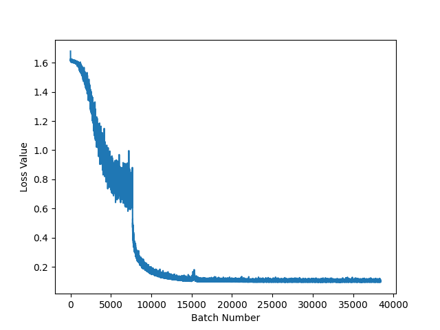
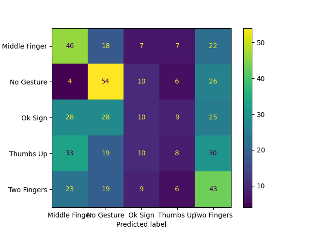

# Trials

Our goal is to gain 90% accuracy or greater on the validation set.

To track both underfitting and overfitting, we will display both the training and validation accuracy.

As a start, we will tune only the learning rate, batch size and epochs, leaving the rest of SGD's hyperparameters at 0; if greater accuracy is desired, we can introduce SGD's other hyperparameters after tuning the former 3.

To start with, we will visualize the loss value over batch iterations, then, if/when we need to perform extremely fine-tuned optimization, we can use a parameter search technique, such as random or grid search.

A visualization of ideal vs non-ideal learning rates [4]:


We start with a learning rate of 0.001, a batch size of 50, and 10 epochs; this yields 35.986% training accuracy and 33.917% validation accuracy. The graph of the loss is below:


We gain 3 insights from this; first off, comparing to the learning rate graph from [4], we see that the learning rate is too high. In addition, due to the high fluctuation of the loss, we can conclude the batch size is too low [4]. Finally, from the accuracies, the model is heavily underfitting; we can solve this by increasing the epochs. 

The new hyperparameters we will use are a learning rate of 0.0001, a batch size of 100, and 15 epochs. This yields 33.431% training accuracy and 33.208% validation accuracy, with the following loss graph:


Noticeable improvement in the learning rate curve, but still too drastic. The fluctuation is better initially, but degrades to the same level of chaos after the learning rate plateaus. A larger batch size is still needed. The model is also still underfitting. 

Now we try a learning rate of 0.00001, a batch size of 150, and 50 epochs. This yields 33.042% training accuracy and 32.833% validation accuracy, with the following loss graph:


Hm...that didn't seem to work either. Perhaps the learning rate is too low? Let's try a learning rate of 0.001 once again, with 50 epochs and a batch size of 150. This yields a 60.806% training and 38.417% validation accuracy, with the following loss graph:


Now we're getting somewhere! Since it seemed like increasing the learning rate was effective, let's try a learning rate of 0.005, 50 epochs and a batch size of 200 to decrease oscillation. This yields 100.0% training accuracy and 67.792% validation accuracy, with the following loss graph:


Much better, but it seems the learning rate is still a bit too low given what we see from the curve (the good news, though, is there is vry little oscillation, our optimal batch size seems to be 200). In addition, it seems that the model is overfitting to the training data. generally, there are two possible reasons for this:

- the training data was unrepresentative

- the model architecture was too complex

Due to all 3 sets having the same distribution of classes, the first one is unlikely; however, the second one is plausible, as Resnet18, despite being one of the smaller ResNets, has over 11 million parameters [5]. There exists an alternative architecture, ShuffleNetV2[6], with approximately 346917 under PyTorch's implementation, so it is much less prone to overfitting in terms of model complexity. In addition, it trains about 13 times faster than AlexNet and achieves comparable accuracy [8]. 

We set the learning rate to 0.01, batch size to 200, and epochs to 50, and our new architecture of ShuffleNetV2 (we use the 1.0x version described in the paper). This yields 50.05555555555556% training accuracy and 39.083333333333336% validation accuracy, with the following loss graph:


Alright, seems we need to increase the learning rate significantly, as well as increase batch size to reduce oscillation. In addition, we will increase the number of epochs, as the model may still be underfitting. We now train with a learning rate of 0.1, a batch size of 300, and 75 epochs. This yields 100.0% training accuracy and 72.25% validation accuracy, with the following loss graph:


Now we're really getting somewhere! Our validation accuracy is the best yet, and it seems there were many unnecessary epochs (though, batch size and learning rate appear to be fine). We reduce epochs to 30, keeping learning rate at 0.1 and batch size at 300, resulting in 99.556% training accuracy and 69.083% validation, with the following loss graph:


It appears this architecture suffers from the same issue as ResNet18; too complex, thus it is overfitting. After some searching, we find the LeNet-5 architecture [9], a relatively small CNN and one of the first major architectures used for MNIST. This architecture has 60 000 parameters (less than 3% of ShuffleNet's 2 million), meaning it will probably overfit much less. There are some modifications we have made; we grayscale the images due to LeNet-5 only accepting 1 color channel. As well, due to the difference in image sizes (126x126 vs the 32x32 LeNet-5 originally expects), the first fully connected layer has 12544 inputs rather than 256.

As a safe default, we will set the learning rate to 0.001, the batch size to 50, and the epochs to 50. This yields 33.333% training accuracy and 33.333%, with the following loss graph:


Learning rate is definitely too low, and the batch size is far too low. We now try a 0.01 learning rate, 150 batch size, and 50 epochs. This yields , with the following loss graph:


Hm...that didn't seem to do much. Since the batch size is relatively large, it is probably the learning rate being too high. At this point, to speed up trials, we will do a grid search over learning rate values. The values we will pick are 0.001, 0.0005, 0.0001, 0.00005 and 0.00001. To be safe, we set the batch size to 200, and we keep the epochs at 50. This yields the following loss graphs and accuracies:

Learning rate = 0.001: 33.333% training accuracy and 33.333% validation accuracy.


Better...

Learning rate = 0.0005: 33.333% training accuracy and 33.333% validation accuracy.


Not better.

Learning rate = 0.0001: 16.708% training accuracy and 16.167% validation accuracy.


Learning rate = 0.00005: 16.667% training accuracy and 16.667% validation accuracy.


Learning rate = 0.00001: 16.667% training accuracy and 16.667% validation accuracy.


Evidently, the model's training is the most stable at a learning rate of 0.001. Though, it seems the model has not had nearly enough epochs to train properly. In addition, there is still lots of variance in the gradient updates, and since learning rate is not the issue (we know this because variance only increased as we increased learning rate), this suggests that the batch size is too small. Thus, we will try a learning rate of 0.001, a batch size of 400, and 500 epochs of training to see what happens. This yields 33.333% training accuracy and 33.333%, with the following loss graph (note, after this point, I decided to grayscale the images to improve not only memory constraints, but time constraints as well. This means the modification from earlier where the input channels was increased to 3 was changed back to 1.):


Ok, somewhat promising. Our loss decreases for some time, then starts to oscillate. Perhaps the learning rate is too high? Trying a learning rate of 0.00001, a batch size of 400, and 500 epochs, yields , with the following loss graph:


Okay, something weird is going on. Time for Googling.

Yup, found the problem; exploding gradients. Turns out, at some points of optimization, the gradient gets so large an oscillating effect happens. The solution to this is to induce a cap on the gradient norm. In our case, we will cap the norm at 2.

We now once again try a learning rate of 0.001, a batch size of 400, and 500 epochs. This yields 33.333% training accuracy and 33.333% validation accuracy, with the following loss graph:


Perhaps that didn't clip the gradients properly. Let's try another method:

```py
for parameter in self.model.parameters():

    parameter.register_hook(lambda gradient: torch.clamp(gradient, -1.0, 1.0))
```

We now once again try a learning rate of 0.001, a batch size of 400, and 500 epochs. This yields 33.333% training accuracy and 33.333% validation accuracy, with the following loss graph:


Ok, the learning rate is definitely too low. In addition, we need to constrain the gradients more. Let's try clamping them to be from -0.1 to 0.1.

We will then try a learning rate of 0.01, a batch size of 400, and 500 epochs. This yields 33.333% training accuracy and 33.333% validation accuracy, with the following loss graph:


Definitely need to restrict the gradient more. We now try clamping them to be from -0.005 to 0.005.

We try the same parameters as before (a learning rate of 0.01, a batch size of 400, and 500 epochs). This yields 33.333% training accuracy and 33.332%, with the following loss graph:


Ok, perhaps the gradient clipping isn't working...I will test this on a subset, and get back to this.

After some testing, and another loss graph with a subset of the data (with a 0.01 learning rate, batch size of 400 and 500 epochs, with the gradient clamped to 1e-4):


Perhaps another way to reduce overfitting would be to go back to ShuffleNet, using L2 regularization to penalize large weights, and thus, force the model to do less overfitting. This time, however, we will use ShuffleNet 0.5x, just to ensure reducing overfitting will be easier with a smaller model (ShuffleNetV2 0.5x has about 1.4 million parameters [7]).

ShuffleNet

To start, we will get a baseline for what hyperparameters in general to use for training. We train, as we did with the last iteration of ShuffleNetV2, with a learning rate of 0.1, a batch size of 300, and 30 epochs. This yields 52.917% training accuracy and 38.0% validation accuracy, with the following loss graph:


Our loss is decreasing steadily once again, but it seems 30 epochs was not enough. In addition, the learning rate seems to be too low, as the reduction in loss was very slow.

No worries, we can simply increase the number of epochs (we will also slightly increase the learning rate to speed up training). We try a learning rate of 0.2, a batch size of 300, and 100 epochs. This yields 100.0% training accuracy and 65.875% validation accuracy, with the following loss graph:


At this point, we will now introduce L2 regularization through SGD's `weight_decay` parameter. To start, we will use a value of 1 for the regularization coefficient.

We train with a learning rate of 0.2, a batch size of 300, and 100 epochs. This yields 33.333% training accuracy and 33.333% validation accuracy, with the following loss graph:


It seems the coefficient was too high; the model is now underfitting. We will try several values of regularization coefficients, including 0.1, 0.01, and 0.001. 

We train with a learning rate of 0.2, a batch size of 300, and 100 epochs.

Regularization coefficient of 0.1: 33.333% training accuracy and 33.333% validation accuracy


Regularization coefficient of 0.01: 33.333% training accuracy and 33.333% validation accuracy


Regularization coefficient of 0.001: 33.333% training accuracy and 33.333% validation accuracy.


Perhaps the values are still too high; I will try 0.0001.

We train with a learning rate of 0.2, a batch size of 300, and 100 epochs. This yields 100.0% training accuracy and 63.875% validation accuracy, with the following loss graph:


Ok, now we're getting somewhere. We'll try values of 0.0002, 0.0004, 0.0006, and 0.0008.

We train with a learning rate of 0.2, a batch size of 300, and 100 epochs. 

Regularization coefficient of 0.0002: 100.0% training accuracy and 66.458% validation accuracy.


Regularization coefficient of 0.0004: 100.0% training accuracy and 67.75% validation accuracy.


Regularization coefficient of 0.0006: 100.0% training accuracy and 69.917% validation accuracy.


Regularization coefficient of 0.0008: 100.0% training accuracy and 67.5% validation accuracy.


We can probably decrease the epochs to 50 at this point, since we don't want to perfectly fit to the training data.

At this point, we try values of 0.00065, 0.0007 and 0.00075 for the regularization coefficient, with a learning rate of 0.2, a batch size of 300, and 50 epochs.

Regularization coefficient of 0.00065: 95.292% training accuracy and 60.0% validation accuracy.


Regularization coefficient of 0.0007: 94.403% training accuracy and 61.375% validation accuracy.


Regularization coefficient of 0.00075: 89.069% training accuracy and 56.458% validation accuracy.


Out of curiosity, we will try an experiment; is the model actually going to overfit when we train beyond 100% training accuracy?

We train with a learning rate of 0.2, a batch size of 300, and 250 epochs, with a regularization coefficient of 0.0006. This yields 100.0% training accuracy and 68.75% validation accuracy, with the following loss graph:


Okay, so it seems that more training can be a benefit. Though, to be safe, we will reduce the epochs to 200, since the validation accuracy did go slightly down.

We train with a regularization constant of 0.0005, learning rate of 0.2, batch size of 300, and 200 epochs. This yields 100.0% training accuracy and 66.542% validation accuracy, with the following loss graph:


Perhaps a higher coefficient with this amount of training would work better?

We train with a regularization constant of 0.005, learning rate of 0.2, batch size of 300, and 200 epochs. This yields 66.319% training accuracy and 51.416% validation accuracy, with the following loss graph:


Ok, the training and validation accuracies are getting closer. We now make a couple modifications; increase epochs to 500 and decrease learning rate to 0.02; these effects offset each other, and prevent the spike we saw on the right of the graph.

We train with a regularization constant of 0.005, learning rate of 0.02, batch size of 300, and 400 epochs. This yields 100.0% training accuracy and 42.958% validation accuracy, with the following loss graph:


Ok, it seems more regularization and epochs are needed. 

We train with a regularization constant of 0.01, learning rate of 0.02, batch size of 300, and 600 epochs. This yields 99.958% training accuracy and 72.583% validation accuracy, with the following loss graph:


Excellent, we're getting somewhere! Let's increase regularization, and slightly increase epochs. 

We train with a regularization constant of 0.02, learning rate of 0.02, batch size of 300, and 700 epochs. This yields 92.097% training accuracy and 62.292% validation accuracy, with the following loss graph:


Ok, we're getting some loss spikes; it seems the only way to reduce them is to increase the batch size [10]. In addition, to reduce overfitting and oscillation, we will lower the learning rate. In addition, we can decrease epochs by quite a bit; they don't seem to be doing much past around the 250 mark (but not by too much, since we have decreased the learning rate).

We train with a regularization constant of 0.02, learning rate of 0.002, batch size of 400, and 450 epochs. This yields 85.889% training accuracy and 26.25% validation accuracy, with the following loss graph:


Alright, learning rate is too low, and it seems like we need more regularization. Can add some epochs for good measure as well.

We train with a regularization constant of 0.05, learning rate of 0.008, batch size of 400, and 500 epochs. This yields 96.681% training accuracy and 66.208% validation accuracy, with the following loss graph:


Let's tune up the learning rate, epochs and regularization. At this point, if the coefficient gets to 0.5 and there is still overfitting, it will be time to introduce dropout.

We train with a regularization constant of 0.2, learning rate of 0.01, batch size of 400, and 600 epochs. This yields 33.333% training accuracy and 33.333% validation accuracy, with the following loss graph:


Ok, our regularization constant was probably too high. It also seems we need to reduce the learning rate when increasing regularization to ensure stability.

We train with a regularization constant of 0.1, learning rate of 0.006, batch size of 400, and 600 epochs. This yields 66.597% training accuracy and 49.917% validation accuracy, with the following loss graph:


Ok, the discrepancy between training and validation accuracy is improving, but it seems the learning rate is still too high. Let's decrease learning rate and increase regularization, also increasing batch size for good measure with respect to stability.

We train with a regularization constant of 0.2, learning rate of 0.001, batch size of 600, and 600 epochs. This yields 54.639% training accuracy and 29.833% validation accuracy, with the following loss graph:


Hm...perhaps using ShuffleNet 0.5x's pre-trained weights will work better? If this doesn't work, then it might be more fruitful to augument the dataset.

We train with pre-trained weights, a regularization constant of 0.0, learning rate of 0.001, batch size of 600, and 600 epochs. This yields 33.333% training accuracy and 33.333% validation accuracy, with the following loss graph:


Alright, definitely time to augument the dataset then. We will first try balancing the class distribution of the dataset (i.e. increasing the image counts for the 4 gestures from 2000 to 4000) by taking flips along the x axis for the 4 gesture classes. This increases our dataset to 20 000 images. 

We train with a learning rate of 0.1, a batch size of 300, and 50 epochs. This yields 93.042% training accuracy and 55.8% validation accuracy, with the following loss graph:


Alright, perhaps the model needs to train more?

We train with a learning rate of 0.1, a batch size of 300, and 200 epochs. This yields 100.0% training accuracy and 66.975% validation accuracy, with the following loss graph:


Ok, it seems that was effective; let's try more training.

We train with a learning rate of 0.1, a batch size of 300, and 400 epochs. This yields 100.0% training accuracy and 66.225% validation accuracy, with the following loss graph:


Alright, it may be time to expand the dataset; we will increase the size of the dataset in 2 steps; creating 8 progressively more blurred versions of each image using box blurring, increasing the dataset to 180 000 images. We will then flip all images along the y axis to double the samples. So our final image dataset now contains 360 000 images. Due to this increase in image size, memory constraints get tight, so the image sizes are reduced to 63x63.

We train with a learning rate of 0.1, a batch size of 500, and 50 epochs. This yields 100.0% training accuracy and 99.968% validation accuracy, with the following loss graph:


Excellent, the model met (and even far exceeded our expectations). However, our job isn't quite done yet.

While yes, our model performed quite well, we still need to get deeper insight into its abilities (and ensure our results are reproducible). For this, we do a few things:

- as the model weights were iniialized randomly, set the random seed ahead of time to ensure the same results for the same hyperparameters.

- use a confusion matrix to test where the model is making mistakes (sure, the model's mistakes were few, but it's still interesting to see which classes it wasn't quite perfect on). This will also give us access to things like precision and recall.

Another thing we need to do is ensure there are no augmentations to the validation set (previously, I did augmentations on the validation and testing set, which I later learned is not advisable).

We train with a learning rate of 0.1, a batch size of 500, and 50 epochs. This yields 100.0% training accuracy and 32.0% validation accuracy, with the following loss graph:


Alright, let's decrease how much time the model trains for.

We train with a learning rate of 0.1, a batch size of 500, and 10 epochs. This yields 99.143% training accuracy and 27.6% validation accuracy, with the following loss graph:


Hm...it seems the augmentations helped the model somehow? I'll invesigate how this is possible.

After some investigation, it appears the augmentation was causing data corruption. More specifically, the resizing portion of preprocessing, rather than resizing the image directly, incorporated padding of black pixels.

I'll try removing the augmentation of varying degrees of blur. 

We train with a learning rate of 0.1, a batch size of 500, and 50 epochs. This yields 100.0% training accuracy and 23.0% validation accuracy, with the following loss graph:


Alright, perhaps we can try switching the model architecture to something even simpler. In addition, let's bring back the blurring augmentation; that seemed to be effective.

We switch to the LeNet-5 architecture [11], visualized below:


This architecture contains less parameters than ShuffleNet, however, we make two changes; we allow 3 input channels since our images are RGB images, and the first fully connected layer needs 2304 nodes rather than 400 to account for image size differences (to be more exact).

Using this new architecture, we train with a learning rate of 0.1, a batch size of 500, and 50 epochs. This yields 96.250% training accuracy and 31.8% validation accuracy, with the following loss graph:


Alright, perhaps the learning rate is too high. Let's decrease it.

We train with a learning rate of 0.01, a batch size of 500, and 100 epochs. This yields 93.522% training accuracy and 30.6% validation accuracy, with the following loss graph:


Let's try using the ShuffleNet architecture again, using our data augmentations. We also decrease the image size to 63x63 due to memory limitations on my local machine.

We train with a learning rate of 0.1, a batch size of 500, and 50 epochs, with an L2 regularization coefficient of 0.01. This yields 96.320% training accuracy and 53.2% validation accuracy, with the following loss graph:


The spikes are a good indication the learning rate is too high. Let's decrease it.

We train with a learning rate of 0.01, a batch size of 500, and 50 epochs, with an L2 regularization coefficient of 0.01. This yields 93.25% training accuracy and 45.6% validation accuracy, with the following loss graph:


Alright, an idea now would be to use a step-based learning rate scheduler to decrease the learning rate at 10 epoch intervals; we will use a gamma value of 0.1 for the scheduler (i.e. at every 10 epoch step the learning rate is multiplied by 0.1).

We train with a learning rate of 0.1, a batch size of 500, and 80 epochs, with an L2 regularization coefficient of 0.01, and using a step based learning rate scheduler with a gamma value of 0.1 and application every 10 epochs. This yields 100.0% training accuracy and 61.0% validation accuracy, with the following loss graph:


Alright, we can definitely see some progress. Let's increase regularization.

We train with a learning rate of 0.1, a batch size of 500, and 80 epochs, with an L2 regularization coefficient of 0.05, and using a step based learning rate scheduler with a gamma value of 0.1 and application every 10 epochs. This yields 29.307% training accuracy and 27.0% validation accuracy, with the following loss graph:


Regularization was too high; let's decrease it.

We train with a learning rate of 0.1, a batch size of 500, and 80 epochs, with an L2 regularization coefficient of 0.03, and using a step based learning rate scheduler with a gamma value of 0.1 and application every 10 epochs. This yields 100.0% training accuracy and 63.6% validation accuracy, with the following loss graph:


Alright, that seemed to work; let's decrease the epochs slightly to avoid overfitting, and increase regularization.

We train with a learning rate of 0.1, a batch size of 500, and 60 epochs, with an L2 regularization coefficient of 0.04, and using a step based learning rate scheduler with a gamma value of 0.1 and application every 10 epochs. This yields 51.78055555555556% training accuracy and 37.0% validation accuracy, with the following loss graph:


Perhaps a regularization in between will work better.

We train with a learning rate of 0.1, a batch size of 500, and 60 epochs, with an L2 regularization coefficient of 0.035, and using a step based learning rate scheduler with a gamma value of 0.1 and application every 10 epochs. This yields 80.60462962962963% training accuracy and 47.6% validation accuracy, with the following loss graph:


We will be introducing some additional pipeline changes to mitigate overfitting and speed up training. Using the MosaicML package, the following changes will be implemented into the pipeline:

- Data Augmentation: Rather than 9 degrees of blurring, we will now have 4, as the extra degrees of blurring may not be helping the model learn (in fact, visually, beyond the 6th blur, the images become nearly unrecognizable).

- Label Smoothing: instead of having one hot encoded labels for classes, the labels will be smoothed with a uniform prior with a strength of 0.1 (i.e. according to the following equation: `smoothed_labels = (original_labels * 0.9) + (0.1 / 5))`). 

- BlurPool: BlurPool increases accuracy while maintaining nearly the same training and inference speed by applying a spatial filter before pooling and convolution operations. A visualization of the effects are below:


BlurPool, label smoothing and the augmentation change are meant for training and generalization improvements, and do not significantly harm training time.

There was another optimization technique, called SAM (Sharpness Aware Minimization) that optimizes loss and loss sharpness at the same time to allow better exploration of the loss landscape. In initial experiments, though, it was found that SAM in this task led the model to a false minimum that resulted in it only predicting one class.

All algorithms described above can be found 

There will be a few changes to the metrics we report; we will be adding precision, recall, F1 score, and the confusion matrix for both the training and validation sets. In addition, these metrics, with accuracy, will be reported by class, rather than overall, in order to gain better insight into the effectiveness of the model on different classes.

When describing metrics, we will use the following format for accuracy, precision, recall and F1 score:

Metric Name: 0.9, 0.3, 0.4, 0.2, 0.7

And will be plotting and displaying the confusion matrix.

Let's go for more epochs to see if the model can be trained further this time around.

We train with a learning rate of 0.01, a batch size of 500, 200 epochs, with a regularization coefficient of 0.04 and with a learning rate scheduler applied every 40 epochs, decreasing the learning rate by a factor of 10. This yields the following metric scores and confusion matrix for training:

Accuracy: 0.9967, 0.9993, 0.9960, 0.9954, 0.9998
Precision: 0.9981, 0.9963, 0.9980, 0.9982, 0.9966
Recall: 0.9967, 0.9993, 0.9960, 0.9954, 0.9998
F1 Score: 0.9974, 0.9978, 0.9970, 0.9968, 0.9982


For validation:

Accuracy: 0.6200, 0.5700, 0.6000, 0.5900, 0.5700
Precision: 0.6526, 0.5044, 0.6383, 0.5728, 0.6000
Recall: 0.6200, 0.5700, 0.6000, 0.5900, 0.5700
F1 Score: 0.6359, 0.5352, 0.6186, 0.5813, 0.5846


And the following loss graph:



Alright, it appears decreasing the learning rate allows us to increase regularization without facing the bottleneck issue we were facing earlier. Let's decrease learning rate, increase regularization, and increase epochs.

We train with a learning rate of 0.001, a batch size of 500, 300 epochs, with a regularization coefficient of 0.1 and with a learning rate scheduler applied every 50 epochs, decreasing the learning rate by a factor of 10. This yields the following metric scores and confusion matrix for training:

Accuracy: 0.0938, 0.6699, 0.1182, 0.6409, 0.3616
Precision: 0.3181, 0.4917, 0.2981, 0.3608, 0.3091
Recall: 0.0938, 0.6699, 0.1182, 0.6409, 0.3616
F1 Score: 0.1449, 0.5671, 0.1693, 0.4617, 0.3333


For validation:

Accuracy: 0.1000, 0.5400, 0.0600, 0.3900, 0.2900
Precision: 0.3846, 0.3803, 0.2222, 0.2143, 0.2358
Recall: 0.1000, 0.5400, 0.0600, 0.3900, 0.2900
F1 Score: 0.1587, 0.4463, 0.0945, 0.2766, 0.2601


And the following loss graph:


Alright, the loss graph suggests the learning rate is too low, and the regularization is causing the model to underfit and not be able to train past a certain point. let's increase learning rate, decrease regularization, and decrease epochs to ensure we can do more rapid testing. 

Though, more comprehensively, decreasing learning rate seems to allow for more regularization, as a lower learning rate means the model will oscillate less when trying to perform gradient descent. What I will try is a very high learning rate, but with a scheduler that updates very frequently (every 5 epochs).

We train with a learning rate of 0.5, a batch size of 500, 100 epochs, a regularization coefficient of 0.1 and a learning rate scheduler applied every 5 epochs, decreasing the learning rate by a factor of 10. This yields the following metric scores and confusion matrix for training:

Accuracy: 0., 1., 0., 0., 0.
Precision: 0.0000, 0.2000, 0.0000, 0.0000, 0.0000
Recall: 0., 1., 0., 0., 0.
F1 Score: 0.0000, 0.3333, 0.0000, 0.0000, 0.0000


For validation:

Accuracy: 0., 1., 0., 0., 0.
Precision: 0.0000, 0.2000, 0.0000, 0.0000, 0.0000
Recall: 0., 1., 0., 0., 0.
F1 Score: 0.0000, 0.3333, 0.0000, 0.0000, 0.0000


And the following loss graph:


Learning rate was definitely too high for a first initialization. Let's decrease it. It also seems the learning rate was decreased too dramatically; let's increase the step size for the scheduler. Though, the model seems to only be predicting one class; could it be due to the high regularization?

We train with a learning rate of 0.1, a batch size of 500, 100 epochs, a regularization coefficient of 0.1 and a learning rate scheduler applied every 8 epochs, decreasing the learning rate by a factor of 10. This yields the following metric scores and confusion matrix for training:

Accuracy: 1., 0., 0., 0., 0.
Precision: 0.2000, 0.0000, 0.0000, 0.0000, 0.0000
Recall: 1., 0., 0., 0., 0.
F1 Score: 0.3333, 0.0000, 0.0000, 0.0000, 0.0000


For validation:

Accuracy: 1., 0., 0., 0., 0.
Precision: 0.2000, 0.0000, 0.0000, 0.0000, 0.0000
Recall: 1., 0., 0., 0., 0.
F1 Score: 0.3333, 0.0000, 0.0000, 0.0000, 0.0000


And the following loss graph:


Learning rate is still too high, as is regularization. Predicting only one class again, so it seems that too high of a regularization forces the model to a fail state.

We train with a learning rate of 0.01, a batch size of 500, 100 epochs, a regularization coefficient of 0.07 and a learning rate scheduler applied every 8 epochs, decreasing the learning rate by a factor of 10. This yields the following metric scores and confusion matrix for training:

Accuracy: 0.5759, 0.8401, 0.1524, 0.1355, 0.5734
Precision: 0.3989, 0.7608, 0.3696, 0.3250, 0.3534
Recall: 0.5759, 0.8401, 0.1524, 0.1355, 0.5734
F1 Score: 0.4713, 0.7985, 0.2158, 0.1913, 0.4373


For validation:

Accuracy: 0.4600, 0.5400, 0.1000, 0.0800, 0.4300
Precision: 0.3433, 0.3913, 0.2174, 0.2222, 0.2945
Recall: 0.4600, 0.5400, 0.1000, 0.0800, 0.4300
F1 Score: 0.3932, 0.4538, 0.1370, 0.1176, 0.3496



And the following loss graph:


We could also try increasing the batch size slightly to decrease oscillation. Let's also increase the frequency of gradient reductions, and decrease regularization slightly.

We train with a learning rate of 0.01, a batch size of 600, 200 epochs, a regularization coefficient of 0.06 and a learning rate scheduler applied every 5 epochs, decreasing the learning rate by a factor of 10. This yields the following metric scores and confusion matrix for training:

Accuracy: 0.3362, 0.5298, 0.2048, 0.1671, 0.1763
Precision: 0.2560, 0.3391, 0.2583, 0.2620, 0.2541
Recall: 0.3362, 0.5298, 0.2048, 0.1671, 0.1763
F1 Score: 0.2907, 0.4135, 0.2285, 0.2041, 0.2082


For validation:

Accuracy: 0.2400, 0.5700, 0.2100, 0.1300, 0.1300
Precision: 0.2069, 0.3585, 0.2442, 0.2031, 0.1733
Recall: 0.2400, 0.5700, 0.2100, 0.1300, 0.1300
F1 Score: 0.2222, 0.4402, 0.2258, 0.1585, 0.1486


And the following loss graph:


At this point, I think the data issues are intractable for this problem. Thus far, the model has overfit for many reasons, some of which I list below:

- the dataset is far too small; 1500 images, even with augmentation to several dozen thousand, it is not enough for a classification task for 5 classes, especially since 4 of the classes are relatively similar (the gestures) compared to one of them (the no gesture class). 

- the variance in the images is high. This can lead to overfitting, as high variance in the images makes it difficult for the model to learn underlying structure.

- model architecture is too complex; a complex model architecture can lead to the model "memorizing the data", as the abundance of parameters will lead to more fine tuning, and thus, more variance in the model predictions caused by the extra parameters picking up noise.

- the image resolution is too low (64 x 64 is pretty small for images considering the usual size is 224 x 224).

Future improvements:

- use an already collected dataset of tens of thousands, hundreds of thousands, or even millions of images. This not only allows for more data, but the data collection techniques are probably more professional than something a hobbyist can come up with.

- find a smaller model; perhaps make a custom one for this task?

For the moment, I will train over 20 random seeds, averaging the results to gain a sense of how the model performs without being biased towards a particularly good or bad seed.

The initial random seed for processing the dataset is 1691883753.241458. I will be listing the 20 random seeds I used for each iteration, with respect to the code I wrote for training. 

For each training iteration, we will be training with a learning rate of 0.01, a batch size of 500, 200 epochs, with a regularization coefficient of 0.04 and with a learning rate scheduler applied every 40 epochs, decreasing the learning rate by a factor of 10.

Seed 1: 1691883970.3270166
Seed 2: 1691888203.4505343
Seed 3: 1691897443.9814541
Seed 4: 1691901613.6147473
Seed 5: 1691939729.9142544
Seed 6: 1691947600.564883
Seed 7: 1691978890.4875207
Seed 8: 1691986336.710399
Seed 9: 1692026021.178986
Seed 10: 1692030043.3519087
Seed 11: 1692044173.4390643
Seed 12: 1692048219.769961
Seed 13: 1692052592.1534941
Seed 14: 1692061847.0878477
Seed 15: 1692066071.2971876
Seed 16: 1692070349.0205696
Seed 17: 1692112955.962577
Seed 18: 1692142890.9382367
Seed 19: 1692196518.7583253
Seed 20: 1692200774.6266866

Overall Results:

Training:

Accuracy: 0.9969299999999996, 0.9986500000000001, 0.9976149999999999, 0.996955, 0.9971
Precision: 0.9977550000000001, 0.9965999999999999, 0.99767, 0.9976700000000001, 0.9975749999999998
Recall: 0.9969299999999996, 0.9986500000000001, 0.9976149999999999, 0.996955, 0.9971
F1 score: 0.9973400000000001, 0.9976199999999998, 0.9976450000000001, 0.9973149999999997, 0.9973399999999998


Validation:
    
Accuracy: 0.6134999999999999, 0.5475000000000001, 0.5894999999999999, 0.5765, 0.622
Precision: 0.61753, 0.548345, 0.5948299999999999, 0.5605, 0.63036
Recall: 0.6134999999999999, 0.5475000000000001, 0.5894999999999999, 0.5765, 0.622
F1 score: 0.6151199999999999, 0.54776, 0.5918449999999998, 0.56815, 0.625685

